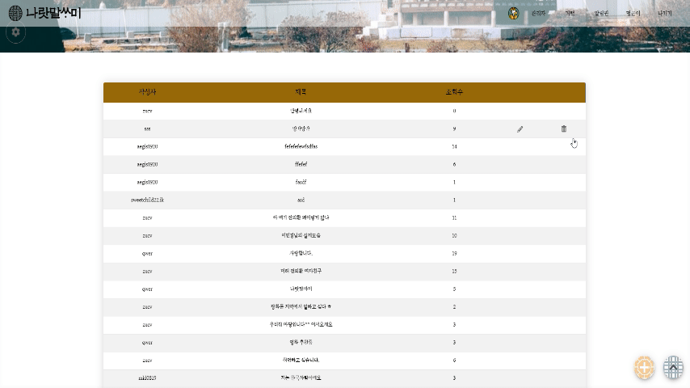
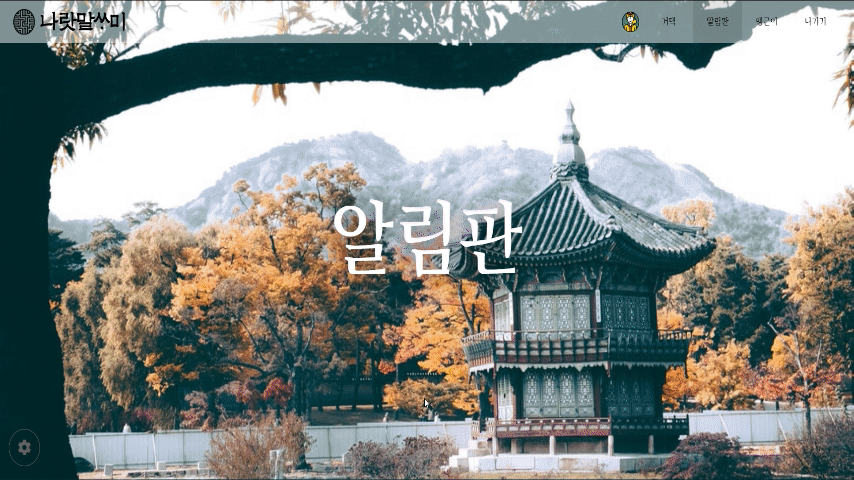
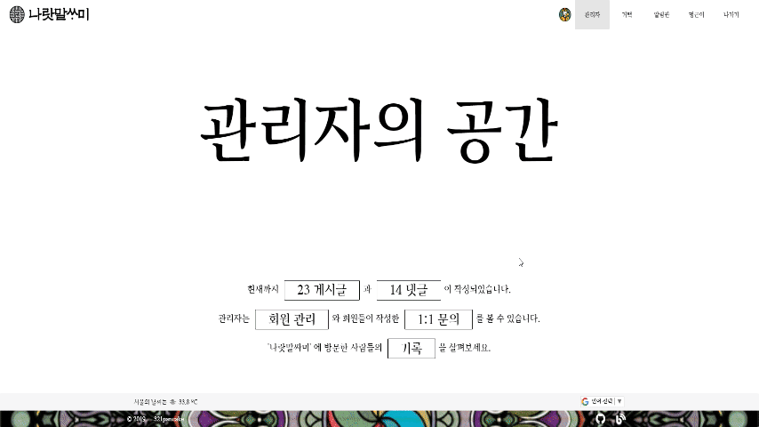
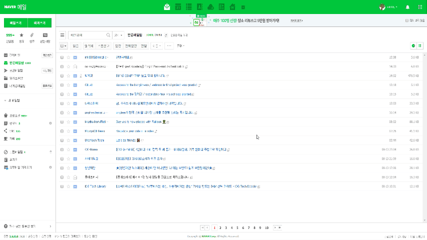

# Naratmalssami

## 프로젝트 개요
한글보다 외국어, 외래어가 익숙한 사람들에게 한글의 아름다움을 느낄 수 있도록 한국 전통을 테마로 한 게시판 서비스

## 프로젝트 아키텍처
UI : Vuetify
Front-end : Vue.js
Back-end : Firebase
Push 알림 : FCM
IDE : VScode

## 프로젝트 실행
```
npm install
npm run serve
```

## 프로젝트 기간
* 2019.07.22 ~ 2019.08.16 (4주)

## 기능
회원관리, 게시판 CRUD, 로그인/아웃, push알람, image 업로드, 챗봇, 메일전송 등의 기능

## 시연 GIF

### main


### login & sign up


### main page to detail page


### board write image upload


### board write push alarm


### board update


### board delete


### infinite scroll


### image banner change


### chatbot


### FAQ page


### post private question


### admin - login


### admin - board page


### admin - user manage


### admin - analytics page


### admin - push alarm


### admin - send mail


### answer mail



